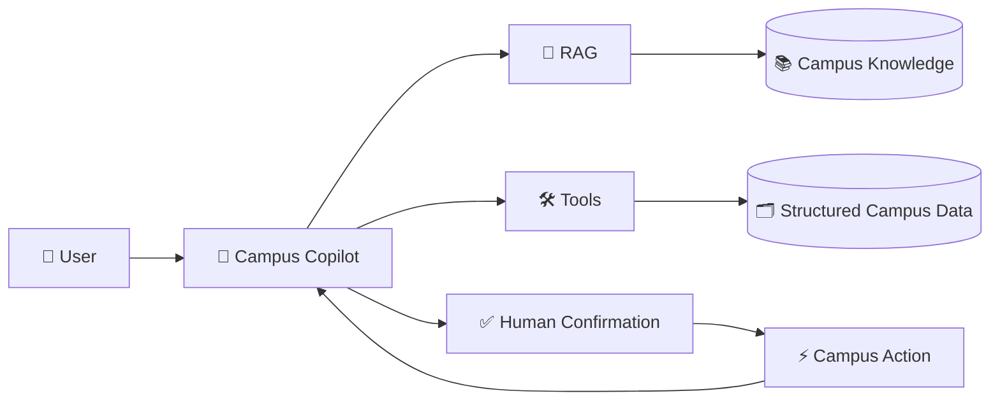
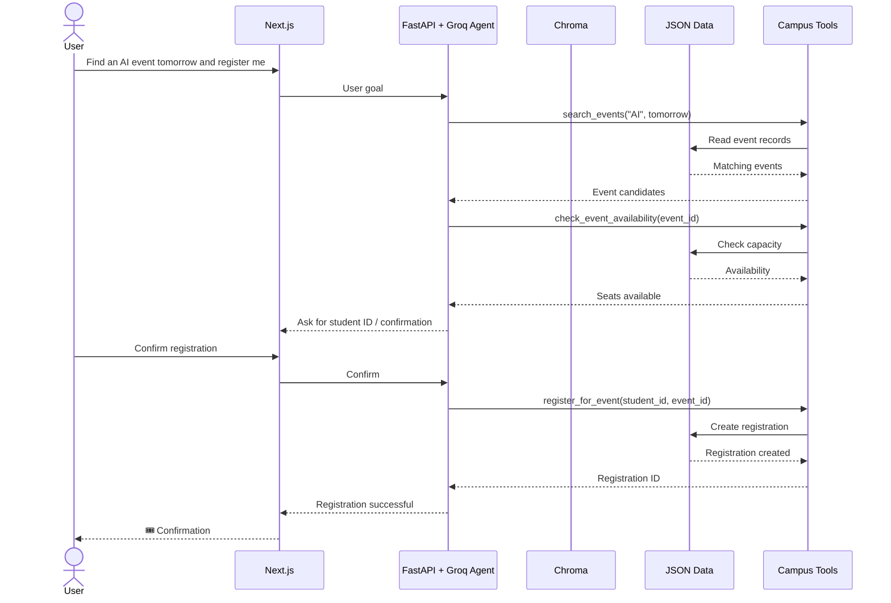
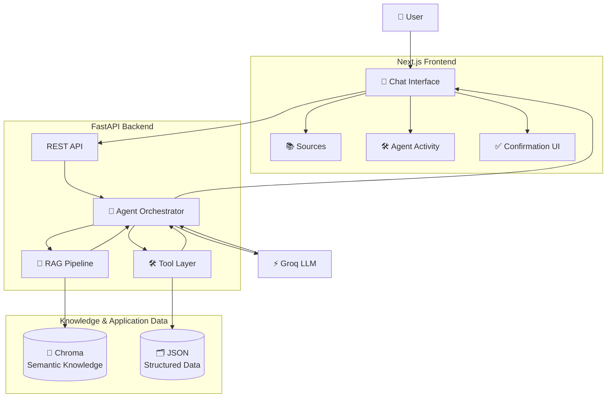
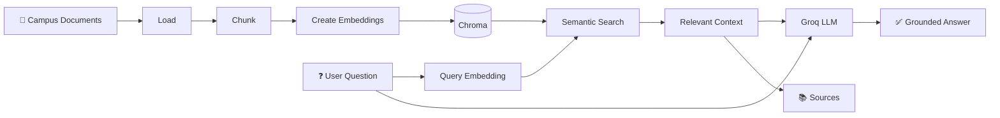
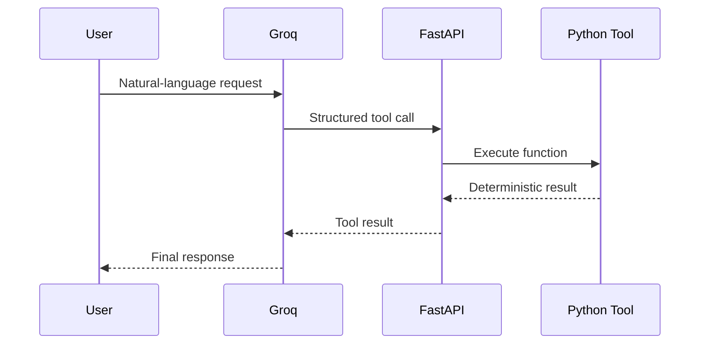
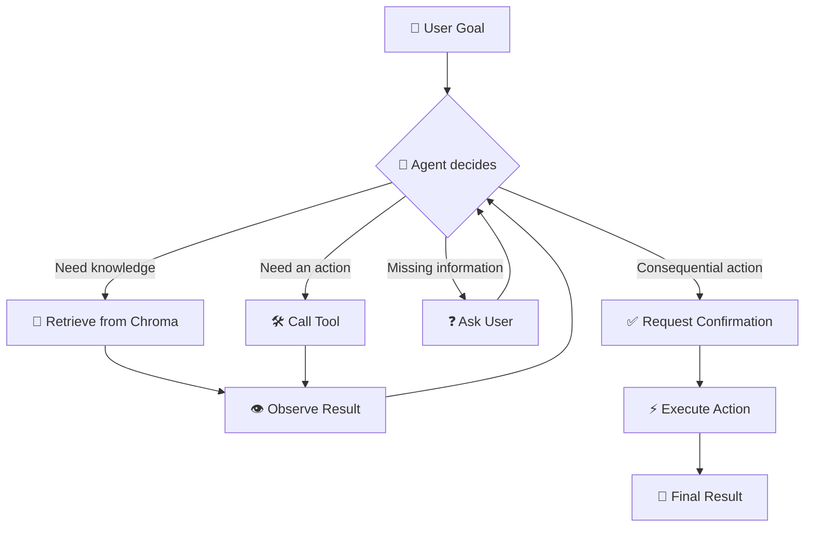
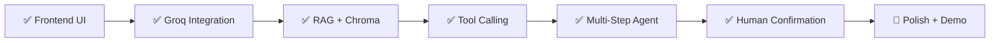

<div align="center">

# 🎓 Campus Copilot

### From Full-Stack Web Apps to Agentic AI

**A practical AI application that combines RAG, semantic search, tool calling, and human-in-the-loop actions to turn a campus assistant into an agent that can actually get things done.**

<br />

[](https://nextjs.org/)
[](https://fastapi.tiangolo.com/)
[](https://www.trychroma.com/)
[](https://groq.com/)
[](https://www.python.org/)
[](https://www.typescriptlang.org/)

<br />

**RAG • Tool Calling • Agentic Workflows • Human-in-the-Loop • Full-Stack AI**

<br />

</div>

---

## ✨ What is Campus Copilot?

Campus Copilot is a **full-stack, agentic AI campus assistant** designed around a simple idea:

> **An AI assistant becomes significantly more useful when it can access the right knowledge, use deterministic tools, and take actions on the user's behalf.**

Instead of stopping at conversational answers, Campus Copilot can combine three layers of capability:



This creates a clean progression:

```text
Traditional Web App
        ↓
AI-Powered App
        ↓
RAG Assistant
        ↓
Tool-Using AI
        ↓
Agentic AI
```

---

## 🎯 The Core Idea

A normal chatbot answers.

A RAG application answers using your own information.

A tool-using AI can call software functions.

An **agent** can decide which information and tools it needs to accomplish a goal.

For example:

> **“Find me an AI-related event tomorrow and register me.”**

The assistant can turn that goal into a multi-step workflow:



That is the central **“this is why agentic AI is powerful”** moment of the project.

---

## 🧠 Architecture



### Technology Roles

| Layer | Technology | Responsibility |
| --- | --- | --- |
| Frontend | **Next.js** | Chat, source cards, tool activity, confirmation UI |
| Backend | **FastAPI** | API endpoints, orchestration, tool execution |
| LLM | **Groq** | Natural-language reasoning and tool calling |
| RAG | **Chroma** | Semantic retrieval over campus knowledge |
| Structured data | **JSON** | Events, students, registrations, capacities |
| Language | **TypeScript + Python** | Frontend and backend implementation |

> **Design choice:** Chroma is used as a Python library rather than as a separate database container. JSON is intentionally used for structured application data to keep the project lightweight and workshop-friendly.

---

## 🔎 RAG Pipeline

Campus Copilot uses Retrieval-Augmented Generation to answer questions grounded in the supplied campus knowledge corpus.



### Example

**User:**

> “What are the library opening hours?”

The application retrieves the relevant section from the campus corpus and uses that context to generate the answer rather than relying only on the LLM's general knowledge.

---

## 🛠️ Agentic Tool Calling

The project deliberately keeps the tool set small. Each tool has a clear purpose and performs deterministic work in Python.

### Core tools

| Tool | Purpose |
| --- | --- |
| `search_events` | Find campus events matching a request |
| `check_event_availability` | Check remaining seats |
| `register_for_event`* | Create a registration |
| `calculate_attendance` | Perform exact attendance calculations |

\* `register_for_event` is the one exception: the model can request it, but the backend never auto-executes it — see [Human-in-the-Loop](#-human-in-the-loop) below.

The model does **not** directly execute these functions. It requests a structured tool call; FastAPI executes the function and returns the result to the model.



---

## ⚡ Why This Is Agentic

The important distinction is not simply **“LLM + tools.”**

The interesting part is the ability to **chain actions toward a user goal**.



A simple chatbot might answer:

> “The AI Odyssey workshop is tomorrow at 3 PM.”

Campus Copilot can instead:

```text
Find the event
      ↓
Check whether seats are available
      ↓
Ask for missing information
      ↓
Prepare the registration
      ↓
Ask the user to confirm
      ↓
Register the student
      ↓
Return the registration ID
```

That is the project's central demonstration of agentic AI.

---

## 🛡️ Human-in-the-Loop

The registration action is deliberately protected by explicit user confirmation.

Before a consequential action, the application presents a confirmation step such as:

```text
┌────────────────────────────────────────┐
│ Registration Confirmation               │
│                                        │
│ Event: AI Odyssey                      │
│ Date: 21 August                        │
│ Time: 3:00 PM                          │
│ Venue: Innovation and Computing Centre │
│ Student: 1RV23IS101                    │
│                                        │
│       [ Confirm ]   [ Cancel ]         │
└────────────────────────────────────────┘
```

This introduces an important production-oriented principle:

> **An agent can reason autonomously, but consequential actions should remain under explicit user control.**

---

## 🏫 Knowledge Corpus

The project is grounded in a curated, human-readable markdown corpus rather than scraped websites or a pile of PDFs — the point is **AI application architecture**, not document-ingestion gymnastics. The corpus itself simulates a complete virtual engineering university (academics, administration, campus life, and policy) so that retrieval has real structure to work with. See [`knowledge/README.md`](knowledge/README.md) for the full corpus design, category breakdown, and example questions.

---

## 🗂️ Project Structure

```text
campus-copilot/
├── frontend/                  # Next.js UI — see frontend/README.md
│   ├── app/
│   │   ├── components/        # chat, agent, rag, events, layout
│   │   ├── about/, events/    # routes
│   │   └── page.tsx           # chat page
│   ├── lib/                   # typed API client + shared types
│   └── package.json
│
├── backend/                   # FastAPI service
│   └── app/
│       ├── agent/             # agent loop, prompts, tool registry
│       ├── api/                # route handlers (chat, events)
│       ├── core/               # config, constants
│       ├── models/              # request/response schemas
│       ├── rag/                 # ingestion, embeddings, retrieval
│       ├── services/            # event + registration business logic
│       ├── tools/               # search_events, registration, attendance
│       └── main.py
│
├── data/                       # structured application data (JSON) — see data/README.md
│   ├── events.json
│   ├── students.json
│   └── registrations.json
│
├── knowledge/                  # curated campus knowledge corpus (RAG source) — see knowledge/README.md
│   ├── academics/
│   ├── administration/
│   ├── campus/
│   ├── student-life/
│   ├── policies/
│   └── faq/
│
└── README.md
```

> UI, orchestration, retrieval, tools, and data are kept in separate, single-responsibility directories on purpose. [`frontend/README.md`](frontend/README.md), [`backend/README.md`](backend/README.md), [`knowledge/README.md`](knowledge/README.md), and [`data/README.md`](data/README.md) each carry their own implementation-specific detail — this file stays focused on the system as a whole.

---

## 🚀 Getting Started

### 1. Clone the repository

```bash
git clone https://github.com/varunaditya27/campus-copilot.git
cd campus-copilot
```

### 2. Install frontend dependencies

```bash
cd frontend
npm install
cp .env.example .env
```

See [`frontend/README.md`](frontend/README.md) for the frontend's design system, component layout, and the API contract it expects from the backend.

### 3. Install backend dependencies

```bash
cd ../backend
python -m venv .venv
```

**Linux / macOS**

```bash
source .venv/bin/activate
pip install -r requirements.txt
```

**Windows**

```powershell
.venv\Scripts\activate
pip install -r requirements.txt
```

```bash
cp .env.example .env    # add your GROQ_API_KEY
```

See [`backend/README.md`](backend/README.md) for the RAG pipeline, the agent loop, tool design, and the full API reference.

### 4. Prepare the knowledge base

Run the project's ingestion script to process the campus knowledge corpus and populate Chroma. See [`knowledge/README.md`](knowledge/README.md) for what's in the corpus and [`backend/README.md`](backend/README.md#-rag-pipeline) for how ingestion works.

```bash
python -m app.rag.ingest
```

### 5. Start FastAPI

```bash
uvicorn app.main:app --reload --port 8000
```

### 6. Start Next.js

In another terminal:

```bash
cd frontend
npm run dev
```

Then open the local development URL shown by Next.js.

---

## 🧪 Example Interactions

### Knowledge retrieval

```text
“What are the library opening hours?”
```

→ Retrieves the relevant campus document and provides a grounded answer.

### Event discovery

```text
“What technical events are happening this week?”
```

→ Uses the event tool to inspect structured event data.

### Multi-step agentic task

```text
“Find an AI-related event tomorrow and register me.”
```

→ Searches events → checks availability → collects missing information → requests confirmation → registers the student.

### RAG + deterministic tool

```text
“I attended 34 out of 42 classes. Am I above the attendance requirement?”
```

→ Retrieves the relevant policy through RAG → calculates the exact percentage with a deterministic tool → combines the results into a grounded answer.

---

## 🧭 Development Roadmap



### Current focus

- [x] Finalize campus knowledge corpus
- [x] Build the frontend UI (chat, agent activity log, confirmation card, events browser)
- [x] Implement the RAG ingestion pipeline
- [x] Implement event search and availability checks
- [x] Implement the registration workflow, gated behind human confirmation
- [x] Wire the frontend up to a working backend end-to-end (verified live, not just curl)
- [ ] Add robust error handling (e.g. Groq unreachable, malformed requests)
- [ ] Add demo-ready sample conversations

---

## 🎓 Educational Value

Campus Copilot is intentionally structured as a learning project and workshop artifact.

It demonstrates the progression:

| Stage | Question it answers |
| --- | --- |
| **Full Stack** | How does a browser communicate with a backend? |
| **LLM Integration** | How do we add generative AI to an application? |
| **RAG** | How can the model use our own knowledge? |
| **Tool Calling** | How can the model interact with software? |
| **Agentic AI** | How can the model decide which actions are needed to accomplish a goal? |
| **Human-in-the-Loop** | How do we keep people in control of consequential actions? |

---

## 💼 Why This Is More Than a Chatbot

A generic LLM wrapper often looks like:

```text
User → API → LLM → Response
```

Campus Copilot looks more like a real AI application:

```text
User
  ↓
Next.js
  ↓
FastAPI
  ↓
Agent
  ├── RAG → Chroma → Campus Knowledge
  ├── Tools → Structured Campus Data
  ├── User Clarification
  └── Confirmation
          ↓
       Action
          ↓
       Result
```

That architecture gives the project meaningful exposure to modern AI engineering concepts without relying on an oversized framework stack.

---

## 🔐 Design Principles

### Keep the system understandable

Every major component should have one obvious responsibility.

### Prefer deterministic software for deterministic work

The LLM decides **when** to use a calculator or registration function. Python performs the actual calculation or data mutation.

### Ground knowledge with retrieval

Campus-specific facts should come from the supplied knowledge corpus rather than being invented by the model.

### Keep actions user-controlled

Registration requires explicit confirmation.

### Minimize infrastructure

No separate vector database server, complex orchestration layer, or unnecessary services are required for the core application.

---

## 🌱 Future Extensions

Possible future directions include:

- Calendar integration
- Email notifications
- Real campus authentication
- Event waitlists
- Personalized recommendations
- Campus navigation
- Student timetable integration
- More sophisticated scheduling agents
- Voice interaction
- Multi-agent workflows
- Production database migration

These are intentionally outside the core scope of the project.

---

## 🤝 Contributing

Contributions are welcome. See [`CONTRIBUTING.md`](CONTRIBUTING.md) for what a good contribution looks like, where things live, and how to submit a change.

---

## 📄 License

MIT — see [`LICENSE`](LICENSE).

---

<div align="center">

### Built to demonstrate one idea:

# **AI that doesn't just answer. It acts.** ⚡

<br />

**Next.js · FastAPI · Chroma · Groq · RAG · Tool Calling · Agentic AI**

<br />

[Repository](https://github.com/varunaditya27/campus-copilot) · [Issues](https://github.com/varunaditya27/campus-copilot/issues)

<br />

⭐ If this project helps you learn or build something interesting, consider starring the repository.

</div>
