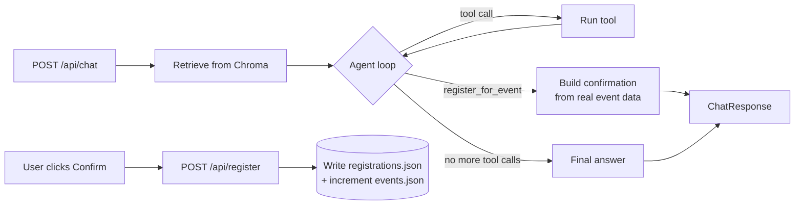

<div align="center">

# ⚙️ Campus Copilot — Backend

### RAG, Tool Calling, and the Agent Loop

**A FastAPI service that turns campus knowledge and structured event data into grounded answers, deterministic tool calls, and human-confirmed actions.**

<br />

[](https://fastapi.tiangolo.com/)
[](https://www.python.org/)
[](https://groq.com/)
[](https://www.trychroma.com/)

<br />

</div>

---

## ✨ What Lives Here

This service owns everything the [frontend](../frontend/README.md) doesn't:

- **Retrieval** — the [`knowledge/`](../knowledge/README.md) corpus, embedded and searched via a local Chroma collection.
- **Tool execution** — deterministic Python functions (`search_events`, `check_event_availability`, `calculate_attendance`, `register_for_event`) that Groq can call.
- **The agent loop** — deciding, per request, whether to answer directly, call a tool, chain several tool calls, or ask the user to confirm a consequential action.
- **Structured data** — events, students, and registrations, read and written as plain JSON.

It's a typed REST API; it has no idea the frontend is a chat UI. For the full-system picture (why Chroma runs in-process, why JSON instead of Postgres, the overall architecture), see the [root README](../README.md).

---

## 🧠 Request Flow



The important asymmetry: **every tool the model can call directly is read-only or purely computational.** The one tool that mutates data (`register_for_event`) is schema-visible to the model but not auto-executed — the agent loop intercepts that specific call and turns it into a confirmation object instead. The actual write only happens through a separate endpoint, triggered by an explicit user action. See [`app/agent/agent.py`](app/agent/agent.py).

---

## 🗂️ Project Structure

```text
backend/
├── app/
│   ├── main.py                    # FastAPI app, CORS, router wiring, /health
│   │
│   ├── api/                       # HTTP layer -- thin, no business logic
│   │   ├── chat.py                 # POST /api/chat
│   │   ├── events.py               # GET /api/events, /api/events/:id
│   │   └── registration.py         # POST /api/register
│   │
│   ├── agent/
│   │   ├── agent.py                # run_agent(): the tool-calling loop
│   │   ├── prompts.py              # system prompt + RAG context builder
│   │   └── tool_registry.py        # Groq tool schemas + dispatch table
│   │
│   ├── rag/
│   │   ├── ingest.py               # builds the Chroma collection from knowledge/
│   │   ├── retriever.py            # query-time retrieval + relevance cutoff
│   │   └── embeddings.py           # embedding function (local, no API key)
│   │
│   ├── tools/                      # functions the model can request
│   │   ├── events.py               # search_events, check_event_availability
│   │   ├── attendance.py           # calculate_attendance
│   │   └── registration.py         # register_for_event (not model-callable)
│   │
│   ├── services/                   # reusable business logic, no HTTP/LLM concerns
│   │   ├── event_service.py        # reads data/events.json
│   │   └── registration_service.py # validates + writes registrations
│   │
│   ├── models/                     # Pydantic request/response schemas
│   │   ├── chat.py
│   │   └── events.py
│   │
│   └── core/
│       ├── config.py                # env vars, paths -- the only os.environ access
│       └── groq_client.py           # cached Groq client
│
├── chroma/                         # persisted vector store (gitignored, rebuilt by ingest.py)
├── requirements.txt
└── .env.example
```

The `api/` → `agent/`+`services/` → `tools/` split is deliberate: HTTP routes stay thin, the agent loop is reusable and testable without a running server, and `services/` functions (like `event_service`) are shared between the plain REST endpoints and the tools the model calls -- no logic is duplicated between "ask a question" and "let the model act."

---

## 🔎 RAG Pipeline

The `knowledge/` corpus (32 markdown files, simulating a complete virtual engineering university -- see [`knowledge/README.md`](../knowledge/README.md) for the full breakdown) is chunked by `##` heading rather than by raw character count, so every retrieved chunk carries a real section title (`library.md · Opening Hours`) instead of an arbitrary offset -- the frontend's source cards display that directly.

```text
knowledge/**/*.md
      ↓  split on "## " headers
(document, section, body) chunks
      ↓  embed locally (all-MiniLM-L6-v2, no API key)
Chroma collection "campus_knowledge"
      ↓  query at chat time
top-k chunks, filtered by distance cutoff
      ↓
injected as context for Groq + returned as `sources`
```

The distance cutoff (`rag/retriever.py`, `MAX_DISTANCE = 1.5`) exists because Chroma always returns its top-k nearest chunks regardless of whether any of them are actually relevant. Without it, an off-topic question would still get citations attached -- which defeats the point of showing sources at all. The threshold was calibrated empirically: on-topic queries against this corpus land at ~0.7-1.3, off-topic queries at ~1.8+.

Rebuild the index after editing `knowledge/`:

```bash
python -m app.rag.ingest
```

Safe to re-run any time -- it wipes and rebuilds the collection from scratch.

---

## 🛠️ Tools & the Agent Loop

| Tool | Model-callable? | What it does |
| --- | --- | --- |
| `search_events` | ✅ | Keyword match over structured event data (not semantic -- events have a fixed schema, so a simple match is enough) |
| `check_event_availability` | ✅ | Remaining-seats lookup |
| `calculate_attendance` | ✅ | Exact arithmetic in Python -- never trust an LLM with math it can just compute wrong |
| `register_for_event` | ⚠️ schema-visible, never auto-executed | Validates event/student/capacity/duplicate and writes the registration |

`app/agent/tool_registry.py` defines Groq's native function-calling schemas and a dispatch table (`TOOL_FUNCTIONS`) mapping name → Python callable. Only the first three tools are in that dispatch table. `register_for_event`'s schema is included so the model can request it with validated arguments (a real `event_id`, a real `student_id`) -- but `run_agent()` special-cases that specific call, looks up the actual event, and returns a `RegistrationConfirmation` instead of executing anything.

The loop itself (`run_agent()` in `agent/agent.py`) is bounded (`MAX_TOOL_ROUNDS = 4`) so the model can chain a few calls -- e.g. `search_events` then `check_event_availability` -- before producing a final answer, without risking an unbounded loop.

---

## 🔌 API

Matches the contract documented in [`frontend/README.md`](../frontend/README.md#-api-contract).

| Endpoint | Purpose |
| --- | --- |
| `GET /health` | Liveness check |
| `GET /api/events` | List all campus events |
| `GET /api/events/{id}` | Single event, 404 if unknown |
| `POST /api/chat` | Send a message, run the agent loop, get back a reply + sources + tool activity + optional confirmation |
| `POST /api/register` | Execute a registration -- the only endpoint that writes to `registrations.json` |

---

## 🚀 Getting Started

```bash
cd backend
python -m venv .venv
source .venv/bin/activate      # .venv\Scripts\activate on Windows
pip install -r requirements.txt

cp .env.example .env           # add your GROQ_API_KEY

python -m app.rag.ingest       # builds the Chroma collection (one-time; downloads
                                # a small local embedding model on first run)

uvicorn app.main:app --reload --port 8000
```

Then confirm it's alive:

```bash
curl http://localhost:8000/health
```

### Environment variables

| Variable | Default | Purpose |
| --- | --- | --- |
| `GROQ_API_KEY` | *(required)* | Your Groq API key |
| `GROQ_MODEL` | `openai/gpt-oss-120b` | Chosen for tool-use/reasoning support -- verify against `GET https://api.groq.com/openai/v1/models` before changing; Groq deprecates models over time and the docs' example model may not match what your account actually has |
| `CORS_ORIGINS` | `http://localhost:3000` | Comma-separated origins allowed to call this API |

---

## 🧩 Notes for Contributors

- Keep HTTP routes in `api/` thin -- business logic belongs in `services/`, `rag/`, or `agent/`, so it can be reused and tested without spinning up a server.
- Any new tool the model should be able to call directly needs a schema in `tool_registry.TOOL_SCHEMAS` **and** an entry in `TOOL_FUNCTIONS`. If it mutates data, think hard about whether it belongs in `TOOL_FUNCTIONS` at all, or whether it needs the same confirmation-interception treatment as `register_for_event`.
- `data/events.json`, `data/students.json`, and `data/registrations.json` live at the repo root, not under `backend/` -- see `core/config.py` for the path resolution.

