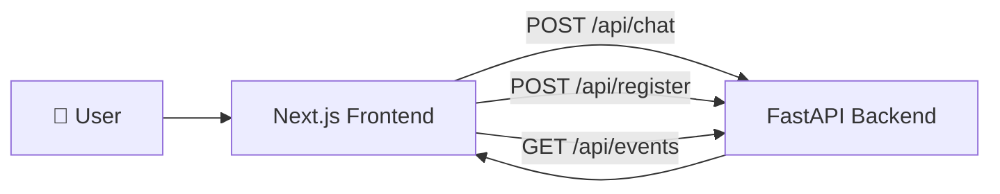

<div align="center">

# 🖥️ Campus Copilot — Frontend

### The Chat, Events, and Confirmation Surface

**A Next.js interface for an agentic campus assistant — a conversation surface, a live agent-activity log, and a human-in-the-loop confirmation step, built to feel like an institutional tool rather than a generic chatbot.**

<br />

[](https://nextjs.org/)
[](https://www.typescriptlang.org/)
[](https://tailwindcss.com/)

<br />

</div>

---

## ✨ What Lives Here

This package is the presentation layer for [Campus Copilot](../README.md). It owns:

- The **chat interface** — the conversation with the agent.
- The **agent activity panel** — a live, plain-language log of what the agent is doing (searching, checking availability, waiting on confirmation).
- The **confirmation card** — the human-in-the-loop gate before any consequential action (event registration) executes.
- The **events browser** — a read-only view of campus events, independent of the chat.

It does **not** own retrieval, tool execution, or agent orchestration — those live in the FastAPI backend. This app is a typed client against that backend's REST API.

For the full-system architecture (RAG pipeline, tool calling, agent loop), see the [root README](../README.md).

---

## 🎨 Design System

The interface is built around a **warm, institutional** register — closer to a university notice board or a printed dossier than a SaaS chat product. Specific choices, and why:

| Decision | Choice | Why |
| --- | --- | --- |
| Display type | [Fraunces](https://fonts.google.com/specimen/Fraunces) | A serif with real optical character, not another generic AI-app sans |
| Body type | [Public Sans](https://fonts.google.com/specimen/Public+Sans) | Humanist, institutional — used by government design systems |
| Mono type | [IBM Plex Mono](https://fonts.google.com/specimen/IBM+Plex+Mono) | Labels, tool activity, IDs, timestamps — anything system-generated |
| Palette | Cream `#F7F3E9` · Navy `#1B2A4A` · Brass `#B8863B` | A campus-institutional palette — no gradients, no default AI purple/blue |
| Cards & separators | Hairline borders, flat fills | No drop shadows, no glassmorphism |
| Motion | Short, precisely-eased transitions (~200–260ms) | State changes are legible, never bouncy or decorative |
| Iconography | Hand-built stroke icons ([`app/components/icons.tsx`](app/components/icons.tsx)) | No icon library, no emoji in the interface itself |

Chat messages render as a labeled transcript (`YOU` / `CAMPUS COPILOT` + rule) rather than rounded bubbles, and the registration confirmation reads as an official form with a navy header bar rather than a modal dialog.

All design tokens live in [`app/globals.css`](app/globals.css) as CSS custom properties, mapped into Tailwind v4 via `@theme inline`.

Assistant replies are markdown — Groq's answers routinely include headings, lists, and tables (a grading scale, a fee breakdown) — so [`app/components/chat/Markdown.tsx`](app/components/chat/Markdown.tsx) renders them with [`react-markdown`](https://github.com/remarkjs/react-markdown) and `remark-gfm` (for tables and task lists) rather than dumping raw asterisks and hashes into a `<p>`. It's not the Tailwind Typography plugin's `prose` class — every element (`h1`–`h3`, lists, `code`/`pre`, `table`) has its own override in that file so markdown output lands in the same hairline-border, no-shadow register as the rest of the interface instead of picking up generic prose defaults. User messages skip this entirely and render as plain text, since a student typing `*` or `#` almost certainly doesn't mean markdown.

---

## 🧠 How This Fits Together



The frontend never talks to Groq, Chroma, or the JSON data files directly — every request goes through the FastAPI backend, which owns orchestration.

---

## 🗂️ Project Structure

```text
frontend/
├── app/
│   ├── page.tsx                  # Chat page (chat column + agent activity panel)
│   ├── layout.tsx                # Root layout, fonts, header
│   ├── globals.css               # Design tokens, base styles, motion utilities
│   ├── about/
│   │   └── page.tsx              # About page
│   ├── events/
│   │   ├── page.tsx              # Events list
│   │   └── [id]/page.tsx         # Single event detail
│   └── components/
│       ├── layout/
│       │   └── Header.tsx        # Masthead navigation
│       ├── chat/
│       │   ├── ChatWindow.tsx    # Message list, empty state, auto-scroll
│       │   ├── ChatInput.tsx     # Message composer
│       │   ├── MessageBubble.tsx # Single transcript turn
│       │   ├── Markdown.tsx      # Styled react-markdown renderer for agent replies
│       │   └── SuggestedPrompts.tsx
│       ├── agent/
│       │   ├── AgentActivity.tsx # Sidebar tool-activity log
│       │   ├── ToolCall.tsx      # Single logged tool step
│       │   └── ConfirmationCard.tsx # Human-in-the-loop registration confirm
│       ├── rag/
│       │   └── SourceCard.tsx    # Citation for a retrieved knowledge chunk
│       ├── events/
│       │   ├── EventCard.tsx     # Event list row
│       │   └── EventDetails.tsx  # Full event detail view
│       └── icons.tsx             # Shared hairline icon set
├── lib/
│   ├── api.ts                    # Typed fetch client for the backend
│   └── types.ts                  # Shared request/response types
├── public/
├── .env.example
└── package.json
```

---

## 🔌 API Contract

The frontend expects the backend to implement the following. This is the contract `lib/api.ts` calls against; the backend is free to change its internals as long as it satisfies these shapes.

### `POST /api/chat`

```json
// Request
{
  "message": "Find an AI-related event tomorrow and register me.",
  "history": [{ "role": "user", "content": "..." }]
}
```

```json
// Response
{
  "reply": "I found AI Odyssey tomorrow at 3:00 PM...",
  "sources": [{ "document": "campus_activities.md", "section": "Technical Events" }],
  "toolActivity": [
    { "id": "t1", "tool": "search_events", "label": "Searching campus events", "status": "done", "resultSummary": "Found 3 matching events" }
  ],
  "confirmation": {
    "event": { "id": "evt_ai_001", "name": "AI Odyssey", "date": "2026-08-21", "time": "15:00", "venue": "Seminar Hall" },
    "studentId": "1RV23IS123"
  }
}
```

`sources`, `toolActivity`, and `confirmation` are all optional — a plain RAG answer omits `toolActivity` and `confirmation`; a pure tool call may omit `sources`.

### `POST /api/register`

```json
// Request
{ "event_id": "evt_ai_001", "student_id": "1RV23IS123" }
```

```json
// Response
{ "success": true, "registration_id": "REG-48291" }
```

### `GET /api/events` / `GET /api/events/:id`

Returns `CampusEvent` objects matching the shape of `data/events.json` at the repo root — see [`lib/types.ts`](lib/types.ts) for the full type.

Until these endpoints exist, pages degrade gracefully to a plain-text error banner rather than crashing — this is expected while the backend is still being built.

---

## 🚀 Getting Started

From the repository root:

```bash
cd frontend
npm install
cp .env.example .env.local   # points at the FastAPI backend, defaults to localhost:8000
npm run dev
```

Then open [http://localhost:3000](http://localhost:3000).

The frontend runs independently of the backend — the chat and events pages will simply show a "could not reach the backend" banner until the FastAPI server (see the [root README](../README.md#-getting-started)) is running.

### Available scripts

| Command | Purpose |
| --- | --- |
| `npm run dev` | Start the Next.js dev server (Turbopack) |
| `npm run build` | Production build |
| `npm run start` | Serve the production build |
| `npm run lint` | Run ESLint |

---

## 🧩 Notes for Contributors

- Keep new UI in the established visual language — no rounded chat bubbles, gradients, drop shadows, or emoji-as-icons. Use [`app/components/icons.tsx`](app/components/icons.tsx) for new icons.
- Design tokens (color, type, motion) live in [`app/globals.css`](app/globals.css) — extend them there rather than hardcoding values in components.
- New backend endpoints should be added to [`lib/api.ts`](lib/api.ts) and [`lib/types.ts`](lib/types.ts) so the rest of the app stays fully typed.
- If a markdown element renders unstyled, add an override to the `components` map in [`app/components/chat/Markdown.tsx`](app/components/chat/Markdown.tsx) — don't reach for the Typography plugin or inline styles, and don't let raw HTML through unstyled.

